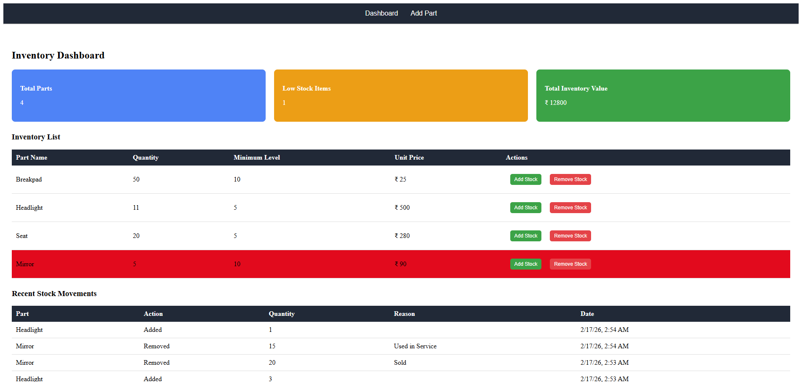
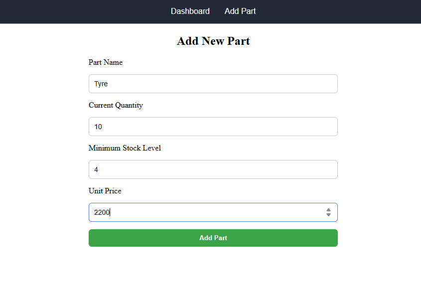
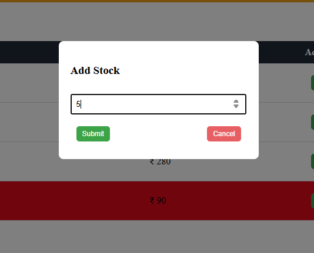
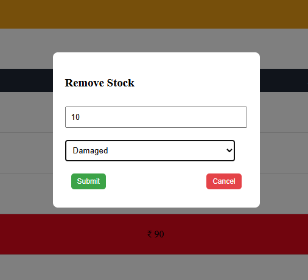

## PROJECT NAME AND DESCRIPTION
# Parts Inventory Tracker
A full-stack inventory management application built using the **MEAN Stack (MongoDB, Express.js, Angular, Node.js)**.

This application helps track spare parts stock, manage inventory levels, monitor low stock items, and maintain stock movement history with a clean and user-friendly dashboard.

## TECHNOLOGIES USED
### Frontend
- Angular (Standalone Components)
- TypeScript
- CSS (Modern responsive styling)
- RxJS

### Backend
- Node.js
- Express.js
- MongoDB (Mongoose)
- CORS
- dotenv

### Database
- MongoDB Atlas (Cloud)

### Deployment
- Frontend: Vercel
- Backend: Render
- Database: MongoDB Atlas

## HOW TO RUN LOCALLY
### Backend
cd backend
npm install
MONGO_URI=your_mongodb_atlas_connection_string
PORT=5000

npm run dev

### Frontend
cd frontend
npm install
ng start

## Deployed URLs
### Vercel(Frontend): 
https://inventory-tracker-hazel.vercel.app/

### Render(Backend):
https://spare-part-qxzo.onrender.com/api/parts

routes:
/dashboard
/history
/add
/add-stock/:id
/remove-stock/:id

## SCREENSHOTS

